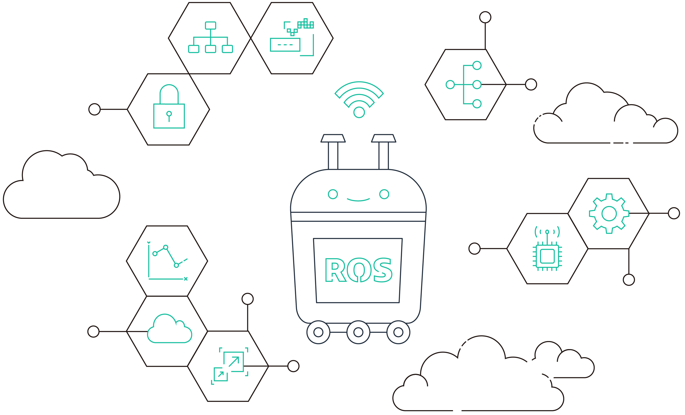
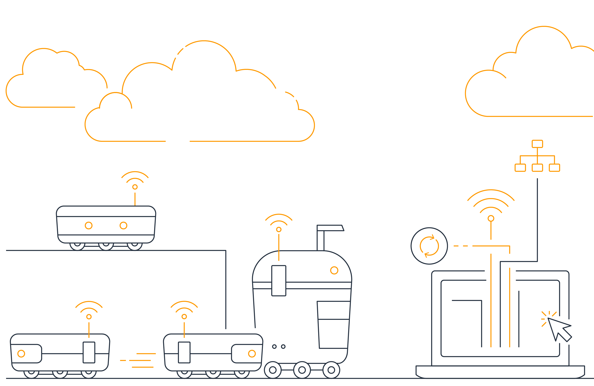

## AWS RoboMaker Robotics Curriculum

Introductory cloud robotics curriculum, designed to help students and entry level developers get started building robotics applications with the Robot Operating System (ROS) and Amazon Web Services (AWS). The curriculum was developed in collaboration with Alberto Quattrini Li, Assistant Professor of Computer Science at Dartmouth University. To get started, instructors and students can access the materials by joining [AWS Educate for free](https://aws.amazon.com/education/awseducate/). For users outside of AWS Educate, the curriculum can be accessed through this repository and build locally.

Developed to be modular, the first three courses span prerequisite topics and basic skills necessary for robotics development using ROS, including:

*  **Fundamentals of Robotics:** this course introduces the basics of robotics, with an overview on robot components, modeling, and main problems to solve, to achieve a fully autonomous system. Primary learning objectives include providing insights to understand robotics hardware and software, and getting students comfortable working with a robotics system capable of executing tasks in a real environment.

* **Getting Started with ROS:** this course walks students through setting up a Linux and Robot Operating System (ROS) development environment. The primary learning objective is to get students comfortable with ROS, and how to write ROS programs to control robots.

* **Getting Started with AWS:** this course guides students through setting up the robot development environment in the cloud utilizing AWS RoboMaker. The objectives of this course include understanding the cloud development environment, preparing to write programs for robots in the cloud, and integration with various AWS cloud services.

_Stay tuned for subsequent courses and tutorials focusing on intermediate and advanced topics with ROS and ROS 2._

## Security

See [CONTRIBUTING](CONTRIBUTING.md#security-issue-notifications) for more information.

## License

This content is licensed under the CC-BY-4.0 License.
